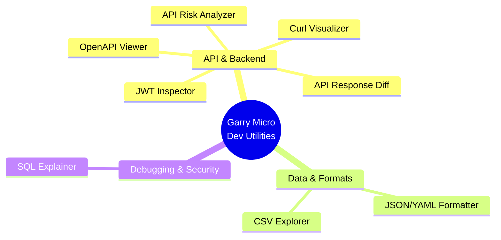
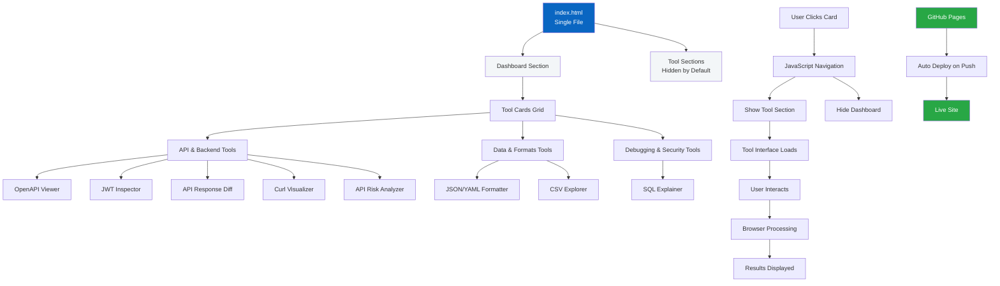
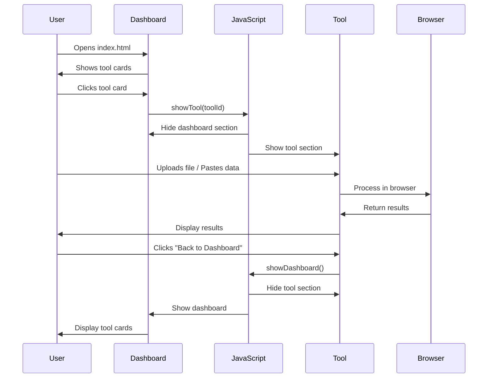
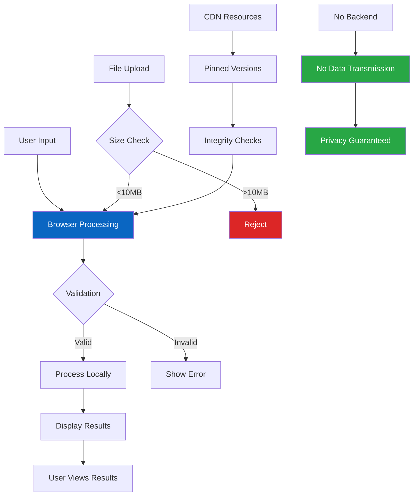
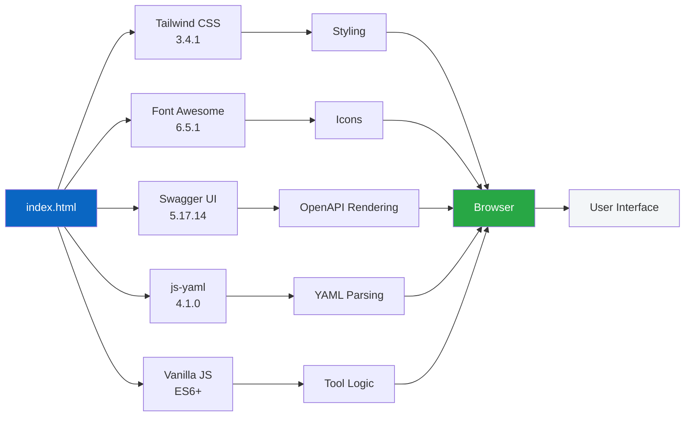

# Garry Micro Dev Utilities

<p align="center">
  <strong>A collection of small, fast, browser-only developer tools</strong><br/>
  that solve everyday engineering problems.
</p>

<p align="center">
  
  
  
  
  
  
</p>

---

## 🎯 Project Vision

**Garry Micro Dev Utilities** is a curated platform of browser-only developer tools inspired by [ilovepdf.com](https://www.ilovepdf.com) but for developers.

### Core Philosophy

- ✅ **Small, sharp utilities** - Each tool does ONE thing well
- ✅ **Zero backend** - Everything runs in your browser
- ✅ **Zero login** - No authentication required
- ✅ **Zero build complexity** - No bundlers, no compilers
- ✅ **Maximum daily usefulness** - Tools you'll actually use

**This is NOT a SaaS. This is NOT a framework. This is a curated toolbox.**

---

## 🚀 Quick Start

### Local Development

```bash
# Start a simple HTTP server
python3 -m http.server 8080

# Open in browser
open http://localhost:8080
```

### Production Deployment

**Deployed on GitHub Pages**

See [DEPLOYMENT.md](DEPLOYMENT.md) for detailed instructions.

**Quick Deploy:**
1. Enable Pages at: https://github.com/girijashankarj/garry-micro-dev-utilities/settings/pages
   - Source: `Deploy from a branch`
   - Branch: `main`
   - Folder: `/ (root)`
2. Push to `main` branch
3. Site will be live at: **https://girijashankarj.github.io/garry-micro-dev-utilities/**

The GitHub Actions workflow will automatically deploy on every push to `main`.

---

## 🛠️ Available Tools

### Tools Overview



### API & Backend

| Tool | Status | Description |
|------|--------|-------------|
| **OpenAPI Swagger Viewer** | ✅ Available | Upload OpenAPI YAML/JSON and render interactive API documentation |
| **JWT Inspector** | ✅ Available | Decode and inspect JWT tokens offline. View header, payload, and expiration warnings |
| **API Response Diff** | ✅ Available | Compare two JSON API responses and highlight semantic differences and breaking changes |
| **Curl Command Visualizer** | ✅ Available | Parse curl commands, visualize headers/params/body, and convert to Fetch/Axios code |
| **API Contract Risk Analyzer** | ✅ Available | Analyze OpenAPI specs for missing error responses, weak validation, and breaking change risks |

### Data & Formats

| Tool | Status | Description |
|------|--------|-------------|
| **JSON / YAML Formatter** | ✅ Available | Format, validate, minify JSON/YAML. Convert between formats. Copy formatted output |
| **CSV Explorer** | ✅ Available | Upload CSV files, render as sortable table, search/filter rows, export to JSON |

### Debugging & Security

| Tool | Status | Description |
|------|--------|-------------|
| **SQL Query Explainer** | ✅ Available | Explain SQL queries without execution. Detect joins, filters, and potential performance issues |

**Total: 8 tools, all fully functional**

---

## 🎨 Design Principles

### User Experience

- **Simple & Clear**: No jargon, self-explanatory interfaces
- **Fast**: Instant results, no waiting
- **Private**: All processing happens in your browser
- **Accessible**: Keyboard navigation, screen reader support
- **Mobile-Friendly**: Works on all devices

### Technical Constraints

- ✅ Frontend only (HTML + CSS + JS)
- ✅ No backend, no database
- ✅ No authentication
- ✅ CDN libraries only
- ✅ Each tool works offline after load
- ✅ No user data stored

---

## 📁 Project Structure

```
garry-micro-dev-utilities/
├── index.html              # Single HTML file with dashboard + all 8 tools
├── samples/                 # Sample data files
│   └── pizza-store.yaml     # Sample OpenAPI spec for testing
├── scripts/                 # Utility scripts
│   └── validate-openapi.js  # OpenAPI validation script
├── .github/workflows/       # CI/CD pipelines
│   ├── ci.yml              # Continuous Integration
│   └── deploy.yml          # GitHub Pages deployment
├── README.md               # This file
├── ARCHITECTURE.md         # Architecture documentation
├── DEPLOYMENT.md           # GitHub Pages deployment guide
├── TOOLS.md                # Detailed tool specifications
├── CONTRIBUTING.md         # Contribution guidelines
├── CHANGELOG.md            # Version history
├── LICENSE                 # MIT License
└── package.json            # Project metadata
```

**Single File Architecture**: All 8 tools are embedded in `index.html`. Click a tool card in the dashboard to load the tool section dynamically.

### Architecture Diagram



### Tool Flow Diagram



See [ARCHITECTURE.md](ARCHITECTURE.md) for detailed architecture.

---

## 🔒 Security & Privacy



**Security Features:**
- ✅ **Content Security Policy** headers on all pages
- ✅ **No external requests** - Tools don't send data anywhere
- ✅ **File size limits** - 10MB default limit per tool
- ✅ **Input validation** - Client-side validation only
- ✅ **Error boundaries** - Graceful error handling
- ✅ **Pinned CDN versions** - All dependencies use specific versions

**All tools run entirely in your browser. No data is sent to any server.**

---

## 🌐 Browser Support

- ✅ Chrome/Edge (latest)
- ✅ Firefox (latest)
- ✅ Safari (latest)
- ✅ Mobile browsers (iOS Safari, Chrome Mobile)

Requires modern browser with ES6+ support.

---

## 🛠️ Technology Stack



**Dependencies:**
- **Styling**: Tailwind CSS 3.4.1 (CDN)
- **Icons**: Font Awesome 6.5.1 (CDN)
- **OpenAPI Rendering**: Swagger UI 5.17.14 (CDN)
- **YAML Parsing**: js-yaml 4.1.0 (CDN)
- **JavaScript**: Vanilla ES6+ (no frameworks)
- **Architecture**: Single HTML file with embedded tools

---

## 📝 Contributing

We welcome contributions! See [CONTRIBUTING.md](CONTRIBUTING.md) for guidelines.

### Adding a New Tool

Since all tools are in a single `index.html` file:

1. Add a tool card to the dashboard section in `index.html`
2. Add a tool section with the tool's HTML/JS implementation
3. Update the navigation JavaScript to handle the new tool
4. Update this README with the new tool
5. Test in multiple browsers
6. Submit a pull request

See [TOOLS.md](TOOLS.md) for detailed tool specifications and patterns.

---

## 📄 License

MIT License - see [LICENSE](LICENSE) file for details.

---

## 🙏 Acknowledgments

- Inspired by [ilovepdf.com](https://www.ilovepdf.com)
- Built with [Tailwind CSS](https://tailwindcss.com)
- Icons by [Font Awesome](https://fontawesome.com)
- OpenAPI rendering by [Swagger UI](https://swagger.io/tools/swagger-ui/)
- YAML parsing by [js-yaml](https://github.com/nodeca/js-yaml)

---

## 🔗 Links

- **Live Site**: https://girijashankarj.github.io/garry-micro-dev-utilities/
- **Repository**: https://github.com/girijashankarj/garry-micro-dev-utilities
- **Issues**: https://github.com/girijashankarj/garry-micro-dev-utilities/issues
- **Deployment Guide**: [DEPLOYMENT.md](DEPLOYMENT.md)
- **Architecture**: [ARCHITECTURE.md](ARCHITECTURE.md)
- **Tool Specifications**: [TOOLS.md](TOOLS.md)

---

<p align="center">
  Made with ❤️ for developers who value simplicity and privacy
</p>
