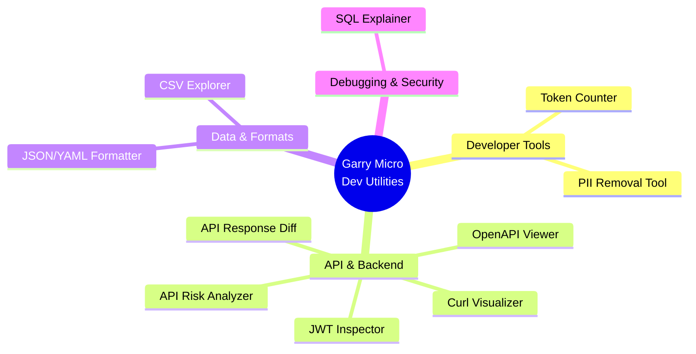
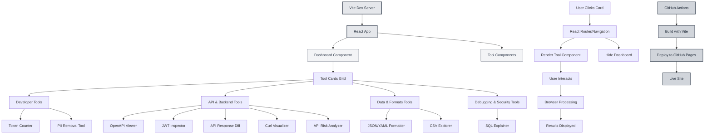
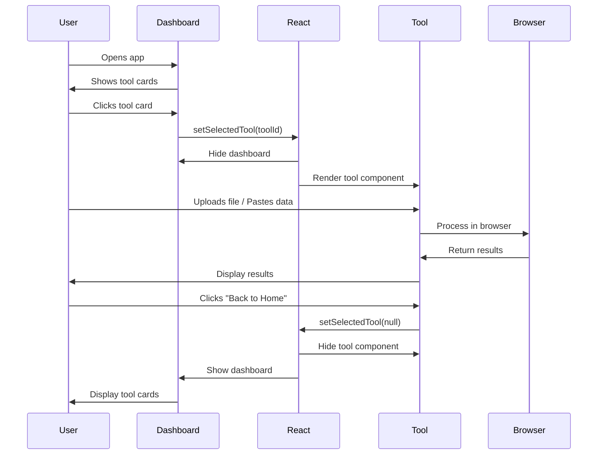
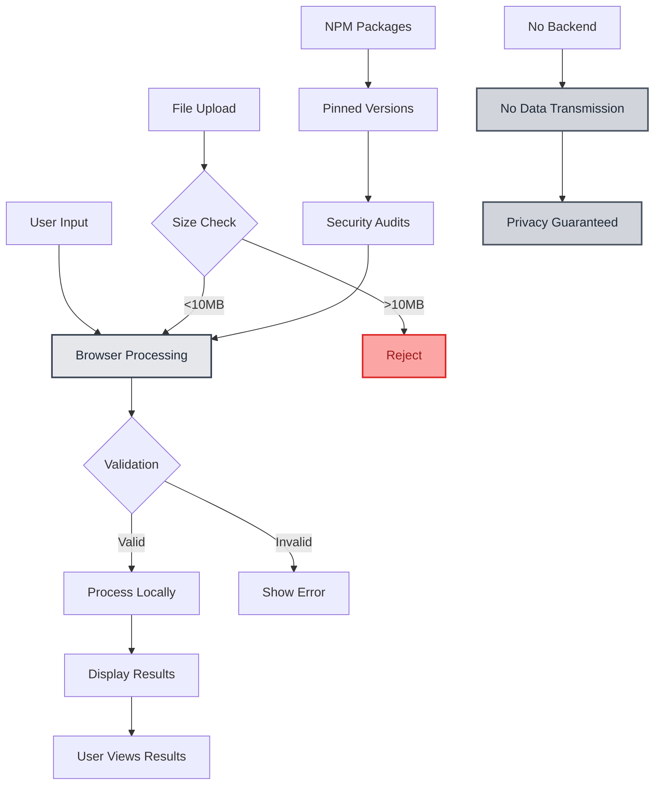
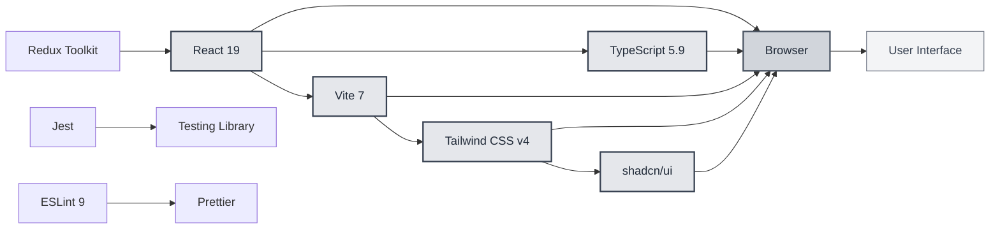

# Garry Micro Dev Utilities

<p align="center">
  <strong>A collection of small, fast, browser-only developer tools</strong><br/>
  that solve everyday engineering problems.
</p>

<p align="center">
  
  
  
  
  
  
</p>

---

## 🎯 Project Vision

**Garry Micro Dev Utilities** is a curated platform of browser-only developer tools inspired by [ilovepdf.com](https://www.ilovepdf.com) but for developers.

### Core Philosophy

- ✅ **Small, sharp utilities** - Each tool does ONE thing well
- ✅ **Zero backend** - Everything runs in your browser
- ✅ **Zero login** - No authentication required
- ✅ **Modern stack** - React 19, TypeScript, Vite
- ✅ **Maximum daily usefulness** - Tools you'll actually use

**This is NOT a SaaS. This is NOT a framework. This is a curated toolbox.**

---

## 🚀 Quick Start

**Prerequisites**: Node.js >= 20.19 (recommended: v24.13.0), npm >= 10

```bash
# Clone the repo
git clone https://github.com/girijashankarj/garry-micro-dev-utilities.git
cd garry-micro-dev-utilities

# Install dependencies
npm install

# Start development server
npm run dev

# Build for production
npm run build

# Run tests
npm test
```

### Production Deployment

**Deployed on GitHub Pages**

See [DEPLOYMENT.md](DEPLOYMENT.md) for detailed instructions.

**Quick Deploy:**
1. Enable Pages at: https://github.com/girijashankarj/garry-micro-dev-utilities/settings/pages
   - Source: `Deploy from a branch`
   - Branch: `main`
   - Folder: `/ (root)` → `/dist` (after build)
2. Push to `main` branch
3. Site will be live at: **https://girijashankarj.github.io/garry-micro-dev-utilities/**

The GitHub Actions workflow will automatically build and deploy on every push to `main`.

---

## 🛠️ Available Tools

### Tools Overview



### API & Backend

| Tool | Status | Description |
|------|--------|-------------|
| **OpenAPI Swagger Viewer** | ✅ Available | Upload OpenAPI YAML/JSON and render interactive API documentation |
| **JWT Inspector** | ✅ Available | Decode and inspect JWT tokens offline. View header, payload, and expiration warnings |
| **API Response Diff** | ✅ Available | Compare two JSON API responses and highlight semantic differences and breaking changes |
| **Curl Command Visualizer** | ✅ Available | Parse curl commands, visualize headers/params/body, and convert to Fetch/Axios code |
| **API Contract Risk Analyzer** | ✅ Available | Analyze OpenAPI specs for missing error responses, weak validation, and breaking change risks |

### Data & Formats

| Tool | Status | Description |
|------|--------|-------------|
| **JSON / YAML Formatter** | ✅ Available | Format, validate, minify JSON/YAML. Convert between formats. Copy formatted output |
| **CSV Explorer** | ✅ Available | Upload CSV files, render as sortable table, search/filter rows, export to JSON |

### Debugging & Security

| Tool | Status | Description |
|------|--------|-------------|
| **SQL Query Explainer** | ✅ Available | Explain SQL queries without execution. Detect joins, filters, and potential performance issues |

### Developer Tools

| Tool | Status | Description |
|------|--------|-------------|
| **Token Counter** | ✅ Available | Count tokens in text or files using GPT tokenizer (cl100k_base). Features color-coded token visualization showing how text is tokenized, with hover tooltips for detailed token information. Includes side-by-side layout with token count statistics and interactive visualization |
| **PII Removal Tool** | ✅ Available | Identify and mask Personally Identifiable Information (PII) from files. Enter keywords to find and mask sensitive data values with custom patterns. Advanced matching options: case sensitivity, complete/substring matching, word boundaries. Download masked files with original format preserved |

**Total: 10 tools, all fully functional**

---

## 🎨 Design Principles

### User Experience

- **Simple & Clear**: No jargon, self-explanatory interfaces
- **Fast**: Instant results, no waiting
- **Private**: All processing happens in your browser
- **Accessible**: Keyboard navigation, screen reader support
- **Mobile-Friendly**: Works on all devices

### Technical Constraints

- ✅ Frontend only (React + TypeScript)
- ✅ No backend, no database
- ✅ No authentication
- ✅ Modern build tooling (Vite)
- ✅ Each tool works offline after load
- ✅ No user data stored

---

## 📁 Project Structure

```
garry-micro-dev-utilities/
├── src/
│   ├── components/          # React components
│   │   ├── tools/          # Tool components
│   │   ├── ui/             # shadcn/ui components
│   │   └── shared/         # Shared components
│   ├── hooks/              # Custom React hooks
│   ├── lib/                # Core business logic
│   │   └── utils/          # Utility functions
│   ├── store/              # Redux Toolkit store
│   ├── types/              # TypeScript types
│   ├── common/             # Constants, messages
│   ├── App.tsx             # Main app component
│   ├── main.tsx            # Entry point
│   └── index.css           # Global styles
├── public/                 # Static assets
│   └── samples/            # Sample data files
│       └── pizza-store.yaml
├── scripts/                # Utility scripts
│   └── validate-openapi.js
├── .github/workflows/      # CI/CD pipelines
│   ├── ci.yml              # Continuous Integration
│   ├── pr-check.yml        # PR checks
│   └── deploy.yml          # GitHub Pages deployment
├── README.md               # This file
├── ARCHITECTURE.md         # Architecture documentation
├── DEPLOYMENT.md           # GitHub Pages deployment guide
├── TOOLS.md                # Detailed tool specifications
├── CONTRIBUTING.md         # Contribution guidelines
├── CHANGELOG.md            # Version history
├── LICENSE                 # MIT License
├── package.json            # Project metadata
├── vite.config.ts          # Vite configuration
├── tsconfig.json           # TypeScript configuration
└── eslint.config.js        # ESLint configuration
```

**Modern React Architecture**: All tools are React components. Click a tool card in the dashboard to navigate to the tool component.

### Architecture Diagram



### Tool Flow Diagram



See [ARCHITECTURE.md](ARCHITECTURE.md) for detailed architecture.

---

## 🔒 Security & Privacy



**Security Features:**
- ✅ **No external requests** - Tools don't send data anywhere
- ✅ **File size limits** - 10MB default limit per tool
- ✅ **Input validation** - Client-side validation with TypeScript
- ✅ **Error boundaries** - Graceful error handling
- ✅ **Pinned dependencies** - All packages use specific versions
- ✅ **Type safety** - TypeScript ensures type safety

**All tools run entirely in your browser. No data is sent to any server.**

---

## 🌐 Browser Support

- ✅ Chrome/Edge (latest)
- ✅ Firefox (latest)
- ✅ Safari (latest)
- ✅ Mobile browsers (iOS Safari, Chrome Mobile)

Requires modern browser with ES6+ support.

---

## 🛠️ Technology Stack



**Dependencies:**
- **React 19** — UI framework
- **TypeScript 5.9** — Type safety
- **Vite 7** — Build tool
- **Tailwind CSS v4** — Styling
- **shadcn/ui** — UI component library
- **Redux Toolkit** — State management
- **Swagger UI React** — OpenAPI rendering
- **js-yaml** — YAML parsing
- **jwt-decode** — JWT token decoding
- **gpt-tokenizer** — Token counting and visualization
- **lucide-react** — Icon library
- **Jest + Testing Library** — Testing
- **ESLint 9 + Prettier** — Code quality

---

## 📝 Development

### Available Scripts

- `npm run dev` — Start development server
- `npm run build` — Build for production
- `npm run preview` — Preview production build
- `npm run lint` — Run ESLint
- `npm run lint:fix` — Fix ESLint errors
- `npm run format` — Format code with Prettier
- `npm run format:check` — Check code formatting
- `npm test` — Run tests with coverage
- `npm run test:coverage` — Run tests with coverage report

### Code Quality

- **Type checking**: `tsc -b`
- **Linting**: ESLint 9 (flat config)
- **Formatting**: Prettier
- **Testing**: Jest + Testing Library (80% coverage minimum)

---

## 📝 Contributing

We welcome contributions! See [CONTRIBUTING.md](CONTRIBUTING.md) for guidelines.

### Adding a New Tool

1. Create a new component in `src/components/tools/`
2. Add the tool to `src/common/constants.ts` (TOOLS array)
3. Import and add to `TOOL_COMPONENTS` mapping in `src/App.tsx`
4. Update this README with the new tool
5. Write tests for the new tool
6. Submit a pull request

See [TOOLS.md](TOOLS.md) for detailed tool specifications and patterns.

### Commit Convention

This project uses [Conventional Commits](https://www.conventionalcommits.org/).

---

## 📄 License

MIT License - see [LICENSE](LICENSE) file for details.

---

## 🙏 Acknowledgments

- Inspired by [ilovepdf.com](https://www.ilovepdf.com)
- Built with [React](https://react.dev) and [Vite](https://vitejs.dev)
- Styled with [Tailwind CSS](https://tailwindcss.com)
- UI components from [shadcn/ui](https://ui.shadcn.com)
- OpenAPI rendering by [Swagger UI](https://swagger.io/tools/swagger-ui/)
- YAML parsing by [js-yaml](https://github.com/nodeca/js-yaml)
- Token counting by [gpt-tokenizer](https://github.com/niieani/gpt-tokenizer)
- Icons from [Lucide](https://lucide.dev)

---

## 🔗 Links

- **Live Site**: https://girijashankarj.github.io/garry-micro-dev-utilities/
- **Repository**: https://github.com/girijashankarj/garry-micro-dev-utilities
- **Issues**: https://github.com/girijashankarj/garry-micro-dev-utilities/issues
- **Deployment Guide**: [DEPLOYMENT.md](DEPLOYMENT.md)
- **Architecture**: [ARCHITECTURE.md](ARCHITECTURE.md)
- **Tool Specifications**: [TOOLS.md](TOOLS.md)

---

<p align="center">
  Made with ❤️ for developers who value simplicity and privacy
</p>
