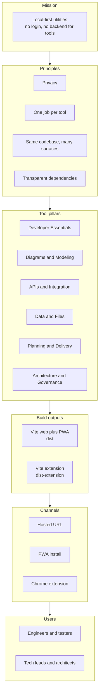
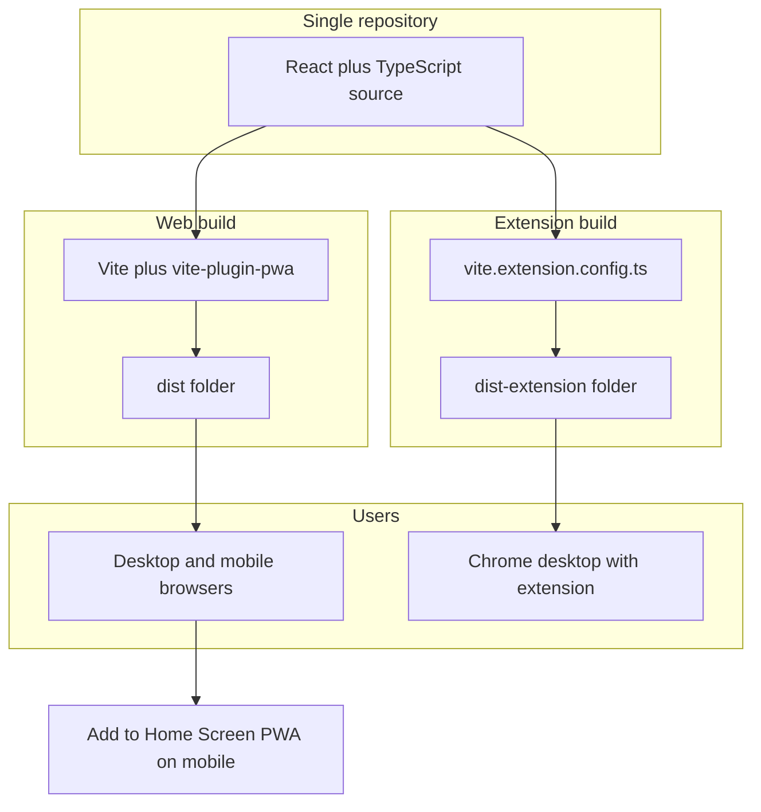
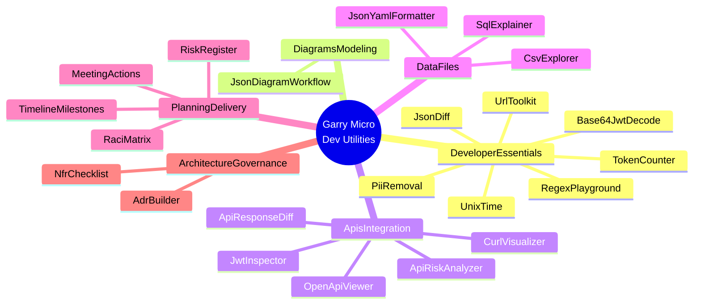
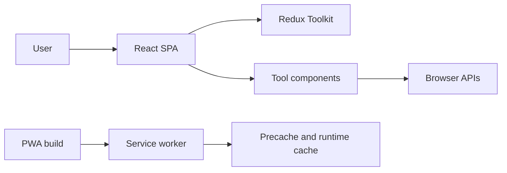
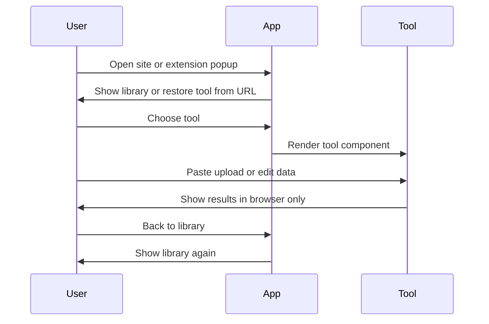
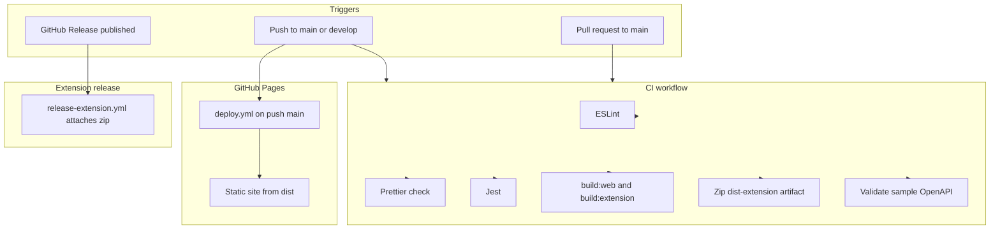
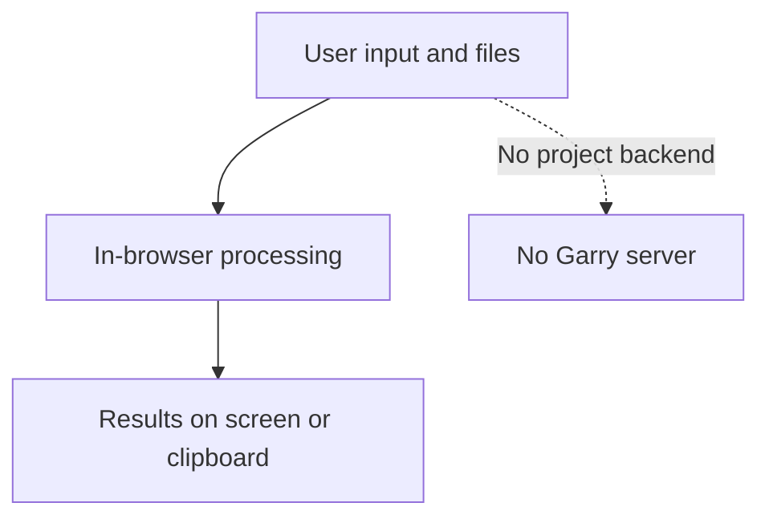

# Garry Micro Dev Utilities

<p align="center">
  <strong>Local-first, browser-only developer utilities</strong><br/>
  for JSON, APIs, data formats, planning, and architecture — no server, no login.
</p>

<p align="center">
  
  
  
  
  
  
</p>

---

## Table of contents

| Section                                                                            | What you will find                            |
| ---------------------------------------------------------------------------------- | --------------------------------------------- |
| [Project agenda](#project-agenda)                                                  | Mission, audience, principles, and priorities |
| [Product overview diagram](#product-overview-diagram)                              | Mermaid map from goals to tools and channels  |
| [Vision and scope](#vision-and-scope)                                              | Goals, non-goals, and boundaries              |
| [Glossary](#glossary)                                                              | Abbreviations used in the app and docs        |
| [Distribution](#distribution-web-progressive-web-app--pwa-chrome-extension-mobile) | Web, PWA, Chrome extension, mobile            |
| [Quick start](#quick-start)                                                        | Clone, install, run, build                    |
| [NPM scripts](#npm-scripts)                                                        | All package.json commands                     |
| [Tool catalog](#tool-catalog)                                                      | Every utility with id, category, and summary  |
| [Tool transparency](#tool-transparency)                                            | How the app documents dependencies per tool   |
| [Architecture](#architecture)                                                      | Runtime, navigation, CI/CD diagrams           |
| [Security and privacy](#security-and-privacy)                                      | Local-only processing                         |
| [Technology stack](#technology-stack)                                              | Major dependencies                            |
| [Browser support](#browser-support)                                                | Supported clients                             |
| [Project structure](#project-structure)                                            | Repository layout                             |
| [Contributing and links](#contributing-and-links)                                  | How to extend the suite                       |

---

## Project agenda

**Garry Micro Dev Utilities** exists so engineers, testers, and technical leads can do **small, sharp jobs** (diff JSON, skim OpenAPI, scrub PII, plan delivery) **without** shipping data to a product backend or creating an account. The agenda is deliberately narrow: **one curated suite**, **one codebase**, **multiple surfaces** (web, PWA, Chrome extension).

| Pillar                | What we optimize for                                                                                            |
| --------------------- | --------------------------------------------------------------------------------------------------------------- |
| **Privacy by design** | Processing stays in the browser; no first-party server for tool workloads.                                      |
| **Clarity**           | One tool, one screen — easy to find, open, and leave.                                                           |
| **Reach**             | Same React app as a hosted site, installable PWA, and optional MV3 extension.                                   |
| **Honesty**           | Each tool can surface **which npm packages** affect its behavior (see [Tool transparency](#tool-transparency)). |
| **Maintainability**   | TypeScript, lint + test in CI, documented patterns for adding tools.                                            |

**Audience:** Individual contributors and leads who already live in browsers and terminals and want **fast utilities** aligned with API work, data inspection, and lightweight planning or governance (RACI, ADRs, NFRs).

**Near-term focus (project direction):**

- Keep the tool set **curated** — prefer a small set of high-quality tools over a sprawling catalog.
- Preserve **offline-friendly** web builds (PWA + service worker) and clear **mobile** guidance (Add to Home Screen).
- Ship the **Chrome extension** as a reproducible artifact (CI zip + optional GitHub Release asset).
- Improve **discoverability** (search, categories, recent tools) without adding accounts or telemetry.

**Explicit non-goals:** Hosted multi-tenant SaaS, user databases, generic low-code platforms, or replacing IDEs and API gateways.

---

## Product overview diagram

This diagram ties the **agenda** to **tool pillars**, **build outputs**, and **how users** reach the app.


```mermaid
flowchart TB
  subgraph mission [Mission]
    M[Local-first utilities<br/>no login, no backend for tools]
  end
  subgraph principles [Principles]
    P1[Privacy]
    P2[One job per tool]
    P3[Same codebase, many surfaces]
    P4[Transparent dependencies]
  end
  subgraph pillars [Tool pillars]
    T1[Developer Essentials]
    T2[Diagrams and Modeling]
    T3[APIs and Integration]
    T4[Data and Files]
    T5[Planning and Delivery]
    T6[Architecture and Governance]
  end
  subgraph builds [Build outputs]
    W[Vite web plus PWA<br/>dist]
    E[Vite extension<br/>dist-extension]
  end
  subgraph channels [Channels]
    C1[Hosted URL]
    C2[PWA install]
    C3[Chrome extension]
  end
  subgraph users [Users]
    U1[Engineers and testers]
    U2[Tech leads and architects]
  end
  mission --> principles
  principles --> pillars
  pillars --> builds
  builds --> channels
  channels --> users
```

---

## Vision and scope

**Garry Micro Dev Utilities** is a **single-page application (SPA)** of small tools that run entirely in the browser. It is inspired by the “one job per page” clarity of sites like [ilovepdf.com](https://www.ilovepdf.com), but aimed at **software engineers, testers, and technical leads**.

| Goal                                | Detail                                                                                                                           |
| ----------------------------------- | -------------------------------------------------------------------------------------------------------------------------------- |
| **Local-first**                     | Workloads run in your browser; nothing is uploaded to an application backend by design.                                          |
| **No account**                      | No sign-up, no API keys required to use the tools.                                                                               |
| **Offline after load**              | The web build is a **Progressive Web App (PWA)** with a service worker so repeat visits can work offline once assets are cached. |
| **Same codebase, multiple outputs** | One React codebase produces the **hosted site** and an optional **Chrome extension** bundle.                                     |

**Non-goals:** This is not a software-as-a-service (SaaS) product, not a generic framework, and not a replacement for dedicated IDEs or API gateways.

---

## Glossary

User-facing copy in the app follows the pattern **full term (abbreviation)** where jargon first appears. This table aligns documentation with the same terms.

| Abbreviation | Full form                                     | Typical use in this project                                   |
| ------------ | --------------------------------------------- | ------------------------------------------------------------- |
| **ADR**      | Architecture Decision Record                  | Structured decisions for tech choices; ADR builder tool.      |
| **API**      | Application programming interface             | REST-style contracts, responses, and risk analysis.           |
| **CI**       | Continuous integration                        | GitHub Actions workflows on push and pull requests.           |
| **CSV**      | Comma-separated values                        | Table exports from several planning tools.                    |
| **GDPR**     | General Data Protection Regulation            | Privacy checklist item in non-functional requirements (NFR).  |
| **JSON**     | JavaScript Object Notation                    | Payloads, configs, diffing, formatting.                       |
| **JWT**      | JSON Web Token                                | Token inspection and decoding tools.                          |
| **LLM**      | Large language model                          | Token counting for prompt sizing and cost hints.              |
| **NFR**      | Non-functional requirements                   | Quality attributes: security, performance, availability, etc. |
| **npm**      | Node Package Manager                          | Package installs and dependency lockfile.                     |
| **OpenAPI**  | OpenAPI Specification                         | Machine-readable API descriptions (often YAML or JSON).       |
| **PII**      | Personally identifiable information           | Data that can identify individuals; masking tool.             |
| **PWA**      | Progressive Web App                           | Installable web app with manifest and service worker.         |
| **RACI**     | Responsible, Accountable, Consulted, Informed | Role assignment matrix for tasks.                             |
| **RegExp**   | Regular expression                            | Pattern matching in the regex playground.                     |
| **RPO**      | Recovery point objective                      | How much data loss is acceptable in a disaster.               |
| **RTO**      | Recovery time objective                       | How long restore may take after an outage.                    |
| **SQL**      | Structured Query Language                     | Query explanation without executing against a database.       |
| **TLS**      | Transport Layer Security                      | Encryption in transit (often referred to with HTTPS).         |
| **URL**      | Uniform Resource Locator                      | Links, query strings, encoding helpers.                       |
| **URI**      | Uniform Resource Identifier                   | Broader identifier class; used in URL toolkit copy.           |
| **YAML**     | YAML Ain’t Markup Language                    | Human-readable data serialization (often used for OpenAPI).   |
| **cURL**     | Client URL (command-line tool)                | `curl` command parsing and code generation.                   |

---

## Distribution: web (Progressive Web App / PWA), Chrome extension, mobile

| Channel              | Artifact                                      | Best for                                       | Mobile (Android / iOS)?                                                                                                 |
| -------------------- | --------------------------------------------- | ---------------------------------------------- | ----------------------------------------------------------------------------------------------------------------------- |
| **Hosted site**      | `npm run build:web` → `dist/`                 | Sharing one URL, full window size, PWA install | Yes — open the URL in the mobile browser; install via **Add to Home Screen** (PWA).                                     |
| **Chrome extension** | `npm run build:extension` → `dist-extension/` | Quick access from Chrome toolbar (desktop)     | **No** — Chrome extensions are not the standard way to “install” on phones. Use the **same PWA URL** on mobile instead. |
| **Source**           | This repository                               | Contributing, forking, custom hosting          | N/A                                                                                                                     |


```mermaid
flowchart TB
  subgraph repo [Single repository]
    Src[React plus TypeScript source]
  end
  subgraph web [Web build]
    ViteWeb[Vite plus vite-plugin-pwa]
    DistWeb[dist folder]
  end
  subgraph ext [Extension build]
    ViteExt[vite.extension.config.ts]
    DistExt[dist-extension folder]
  end
  subgraph users [Users]
    Browser[Desktop and mobile browsers]
    ChromeDesktop[Chrome desktop with extension]
  end
  Src --> ViteWeb
  Src --> ViteExt
  ViteWeb --> DistWeb
  ViteExt --> DistExt
  DistWeb --> Browser
  DistExt --> ChromeDesktop
  Browser --> PWAInstall[Add to Home Screen PWA on mobile]
```

**Mobile install (recommended path):** deploy or open the **hosted web app**, then use the browser’s **Add to Home Screen** (or equivalent). That uses the **web app manifest** and service worker from the PWA build — the same experience users expect on Android and iOS Safari, without an app store.

### Install icon / app preview (Chrome and standalone mode)

| Topic                                            | Detail                                                                                                                                                                                                                                                                                                                                                                                                                   |
| ------------------------------------------------ | ------------------------------------------------------------------------------------------------------------------------------------------------------------------------------------------------------------------------------------------------------------------------------------------------------------------------------------------------------------------------------------------------------------------------ |
| **Why the install preview was missing**          | Chrome’s install UI expects **PNG** icons (**192×192** and **512×512**). A manifest that only listed **SVG** often shows a blank or generic install preview. This repo ships **`public/pwa-192.png`**, **`public/pwa-512.png`**, and **`public/apple-touch-icon.png`** (regenerated from `favicon.svg` via `npm run icons` or automatically before `build:web`).                                                         |
| **Which browser for “like an app” (standalone)** | **Chrome or Edge** (desktop or Android): install from the menu → opens in its **own window** with `display: standalone`. **Safari (iOS / iPadOS)**: **Share → Add to Home Screen** — standalone home-screen icon (use **`apple-touch-icon`**). **Samsung Internet** (Android): similar to Chrome. Use the **real HTTPS URL** of the site (or `localhost` for dev); installability does not apply to raw `file://` pages. |
| **After changing the logo**                      | Run **`npm run icons`** and commit the updated PNGs under **`public/`**.                                                                                                                                                                                                                                                                                                                                                 |

**Release builds:** When you **publish a GitHub Release**, the workflow [`.github/workflows/release-extension.yml`](.github/workflows/release-extension.yml) builds the extension and attaches **`garry-micro-dev-utilities-chrome.zip`** as a release asset (Chrome Web Store–ready layout). CI on every qualifying run also uploads a **`chrome-extension`** artifact from the zipped `dist-extension` output.

---

## Quick start

**Prerequisites:** Node.js **>= 20.19** (project CI uses Node 24), **npm** (Node Package Manager) **>= 10**.

| Step                   | Command                                                                     |
| ---------------------- | --------------------------------------------------------------------------- |
| Clone                  | `git clone https://github.com/girijashankarj/garry-micro-dev-utilities.git` |
| Enter directory        | `cd garry-micro-dev-utilities`                                              |
| Install                | `npm ci` or `npm install`                                                   |
| Development server     | `npm run dev`                                                               |
| Production web build   | `npm run build:web`                                                         |
| Chrome extension build | `npm run build:extension`                                                   |
| Both builds            | `npm run build:all`                                                         |

**Load the unpacked extension:** run `npm run build:extension`, then in Chrome go to **Extensions → Load unpacked** and select the `dist-extension` folder.

**Production deployment (GitHub Pages):** see [DEPLOYMENT.md](DEPLOYMENT.md). The live site is typically at **https://girijashankarj.github.io/garry-micro-dev-utilities/** when Pages is enabled on `main`.

---

## NPM scripts

| Script                    | Purpose                                                                         |
| ------------------------- | ------------------------------------------------------------------------------- |
| `npm run dev`             | Start Vite dev server                                                           |
| `npm run build`           | Alias for `build:web`                                                           |
| `npm run icons`           | Regenerate PWA PNG icons from `favicon.svg`                                     |
| `npm run build:web`       | Typecheck (`tsc -b`) then Vite production build (pre-step runs icon generation) |
| `npm run build:extension` | Typecheck then extension bundle to `dist-extension/`                            |
| `npm run build:all`       | `build:web` then `build:extension`                                              |
| `npm run preview`         | Preview the web production build                                                |
| `npm run lint`            | ESLint with zero warnings allowed                                               |
| `npm run lint:fix`        | ESLint with auto-fix                                                            |
| `npm run format`          | Prettier write                                                                  |
| `npm run format:check`    | Prettier check only                                                             |
| `npm test`                | Jest with coverage                                                              |
| `npm run validate`        | Sample OpenAPI validation helper script                                         |

---

## Tool catalog

All tools are registered in `src/common/constants.ts` (`TOOLS`) and mounted from `src/App.tsx`. **22** tools are listed below. The **id** matches the route query parameter in the Chrome extension build (`?tool=`) and the **`/tools/:id`** path on the web.

**Route alias:** `node-mapper` redirects to `json-diagram-workflow` (see `TOOL_ROUTE_ALIASES` in `src/lib/appToolRoutes.ts`).

| Id                           | Name (as shown in UI)                                       | Category                  |
| ---------------------------- | ----------------------------------------------------------- | ------------------------- |
| `json-diff-tool`             | JavaScript Object Notation (JSON) diff (fixed left / right) | Developer Essentials      |
| `encoding-utils`             | Base64 + JSON Web Token (JWT) decode                        | Developer Essentials      |
| `json-diagram-workflow`      | JSON Diagram & Workflow                                     | Diagrams & Modeling       |
| `url-toolkit`                | Uniform Resource Locator (URL) toolkit                      | Developer Essentials      |
| `unix-time-converter`        | Unix time converter                                         | Developer Essentials      |
| `regex-playground`           | Regular expression (RegExp) playground                      | Developer Essentials      |
| `token-counter`              | Token counter                                               | Developer Essentials      |
| `pii-removal`                | Personally identifiable information (PII) removal           | Developer Essentials      |
| `openapi-viewer`             | Swagger / OpenAPI (API specification) preview               | APIs & Integration        |
| `jwt-inspector`              | JSON Web Token (JWT) inspector                              | APIs & Integration        |
| `api-response-diff`          | Application programming interface (API) response diff       | APIs & Integration        |
| `curl-visualizer`            | cURL (command-line URL) command visualizer                  | APIs & Integration        |
| `api-risk-analyzer`          | API contract risk analyzer (OpenAPI)                        | APIs & Integration        |
| `json-yaml-formatter`        | JavaScript Object Notation (JSON) / YAML formatter          | Data & Files              |
| `sql-explainer`              | Structured Query Language (SQL) query explainer             | Data & Files              |
| `csv-explorer`               | Comma-separated values (CSV) explorer                       | Data & Files              |
| `raci-matrix`                | Responsible, Accountable, Consulted, Informed (RACI) matrix | Planning & Delivery       |
| `risk-register`              | Risk register                                               | Planning & Delivery       |
| `meeting-action-tracker`     | Meeting notes & actions                                     | Planning & Delivery       |
| `timeline-milestone-planner` | Timeline & milestones                                       | Planning & Delivery       |
| `adr-builder`                | Architecture Decision Record (ADR) builder                  | Architecture & Governance |
| `nfr-checklist`              | Non-functional requirements (NFR) checklist                 | Architecture & Governance |


```mermaid
mindmap
  root((Garry Micro<br/>Dev Utilities))
    DeveloperEssentials
      JsonDiff
      Base64JwtDecode
      UrlToolkit
      UnixTime
      RegexPlayground
      TokenCounter
      PiiRemoval
    DiagramsModeling
      JsonDiagramWorkflow
    ApisIntegration
      OpenApiViewer
      JwtInspector
      ApiResponseDiff
      CurlVisualizer
      ApiRiskAnalyzer
    DataFiles
      JsonYamlFormatter
      SqlExplainer
      CsvExplorer
    PlanningDelivery
      RaciMatrix
      RiskRegister
      MeetingActions
      TimelineMilestones
    ArchitectureGovernance
      AdrBuilder
      NfrChecklist
```

---

## Tool transparency

Each tool definition includes a **transparency** block: a short summary of how the tool works and a list of **domain-relevant npm packages** (not the entire app shell). On tool pages, the **Transparency** section reflects that data so you can see, at a glance, whether a screen is **browser APIs only** or uses libraries such as **Swagger UI**, **Mermaid**, or **React Flow** (`@xyflow/react`). Copy for this feature lives in `BRAND` and `ToolTransparency` types in `src/common/constants.ts`; UI is implemented in `src/components/ToolTransparency.tsx`.

---

## Architecture

### High-level runtime


```mermaid
graph LR
  User[User] --> UI[React SPA]
  UI --> State[Redux Toolkit]
  UI --> Tools[Tool components]
  Tools --> BrowserAPIs[Browser APIs]
  WebBuild[PWA build] --> SW[Service worker]
  SW --> Cache[Precache and runtime cache]
```

### In-app navigation (web vs extension)

On the **web** build, the selected tool is reflected in the path **`/tools/:toolId`** (with optional GitHub Pages base path). On the **extension** build, the same state uses the query parameter **`?tool=`** so it does not collide with OpenAPI share links that use the URL **hash** fragment.


```mermaid
sequenceDiagram
  participant User
  participant App
  participant Tool
  User->>App: Open site or extension popup
  App->>User: Show library or restore tool from URL
  User->>App: Choose tool
  App->>Tool: Render tool component
  User->>Tool: Paste upload or edit data
  Tool->>User: Show results in browser only
  User->>App: Back to library
  App->>User: Show library again
```

### Continuous integration and deployment


```mermaid
flowchart TB
  subgraph triggers [Triggers]
    PR[Pull request to main]
    Push[Push to main or develop]
    Release[GitHub Release published]
  end
  subgraph ci [CI workflow]
    Lint[ESLint]
    Fmt[Prettier check]
    Test[Jest]
    Build[build:web and build:extension]
    Zip[Zip dist-extension artifact]
    Val[Validate sample OpenAPI]
  end
  subgraph pages [GitHub Pages]
    Deploy[deploy.yml on push main]
    Site[Static site from dist]
  end
  subgraph extrel [Extension release]
    RelZip[release-extension.yml attaches zip]
  end
  PR --> ci
  Push --> ci
  Push --> Deploy
  Deploy --> Site
  Release --> RelZip
  ci --> Lint
  ci --> Fmt
  ci --> Test
  ci --> Build
  ci --> Zip
  ci --> Val
```

**Workflow files:** `ci.yml` (lint, format, test, build, extension zip artifact, OpenAPI validation), `pr-check.yml` (PR-focused checks), `deploy.yml` (GitHub Pages), `release-extension.yml` (release asset).

---

## Security and privacy

| Topic                       | Behavior                                                                                                                                               |
| --------------------------- | ------------------------------------------------------------------------------------------------------------------------------------------------------ |
| **Data leaving the device** | Tools are designed to process input locally. There is no first-party backend in this repository.                                                       |
| **Third-party calls**       | Optional links (for example to **npm** package pages or documentation) open in a new tab; core tools do not require calling your APIs from our server. |
| **Files**                   | Large uploads are bounded per tool (for example OpenAPI files up to **10 MB** in the viewer).                                                          |
| **Extension permissions**   | The MV3 manifest ships with **no host permissions**; see `scripts/extension-scope.json` for the rationale.                                             |


```mermaid
flowchart TB
  Input[User input and files] --> Local[In-browser processing]
  Local --> Out[Results on screen or clipboard]
  Input -.->|No project backend| Nowhere[No Garry server]
```

---

## Technology stack

| Layer                       | Choice                                                |
| --------------------------- | ----------------------------------------------------- |
| UI                          | React 19, TypeScript                                  |
| Styling                     | Tailwind CSS v4, **shadcn**-style Radix UI primitives |
| State                       | Redux Toolkit                                         |
| Build                       | Vite 7, `@vitejs/plugin-react`                        |
| PWA                         | `vite-plugin-pwa` with `injectManifest` (`src/sw.ts`) |
| OpenAPI UI                  | `swagger-ui-react`, `js-yaml`                         |
| JWT decode (inspector tool) | `jwt-decode`                                          |
| Tokenizer                   | `gpt-tokenizer`                                       |
| Diagrams                    | `@xyflow/react`, `mermaid`                            |
| Quality                     | ESLint 9, Prettier, Jest, Testing Library             |

---

## Browser support

| Client        | Notes                                                                        |
| ------------- | ---------------------------------------------------------------------------- |
| Chrome / Edge | Fully supported; extension targets Chromium.                                 |
| Firefox       | Supported for the web app.                                                   |
| Safari        | Supported; PWA install behavior follows **iOS** / **macOS** Safari rules.    |
| Mobile        | Use the **web/PWA** URL; test **Add to Home Screen** on your target devices. |

Requires a modern **ECMAScript** environment (ES2022 class fields and standard Web APIs used by Vite’s browser target).

---

## Project structure

```
garry-micro-dev-utilities/
├── extension/                 # Chrome MV3 manifest (copied into dist-extension)
├── public/                    # Static assets (favicon, PWA icons, robots.txt)
├── samples/                   # Example OpenAPI YAML
├── scripts/                   # validate-openapi.js, extension-scope.json, generate-pwa-icons.mjs
├── src/
│   ├── App.tsx                # Library + tool routing
│   ├── main.tsx               # Web entry (PWA registration)
│   ├── extension-main.tsx     # Extension entry (no service worker)
│   ├── components/tools/      # One folder per tool
│   ├── components/ui/         # Shared UI primitives
│   ├── components/ToolTransparency.tsx
│   ├── common/constants.ts    # TOOLS definitions and BRAND copy
│   ├── config/distribution.ts # PWA vs extension vs mobile notes
│   ├── lib/                   # Routing, search, OpenAPI helpers
│   ├── store/                 # Redux store
│   └── sw.ts                  # Service worker source for PWA
├── vite.config.ts             # Web + PWA
├── vite.extension.config.ts   # Extension bundle
├── full.html                  # Extension HTML entry
└── .github/workflows/         # ci.yml, pr-check.yml, deploy.yml, release-extension.yml
```

---

## Contributing and links

- **Contributing:** [CONTRIBUTING.md](CONTRIBUTING.md)
- **Tool patterns:** [TOOLS.md](TOOLS.md)
- **Architecture deep dive:** [ARCHITECTURE.md](ARCHITECTURE.md)
- **Deploy:** [DEPLOYMENT.md](DEPLOYMENT.md)
- **Changelog:** [CHANGELOG.md](CHANGELOG.md)
- **License:** [LICENSE](LICENSE) (MIT)

| Resource   | URL                                                                |
| ---------- | ------------------------------------------------------------------ |
| Live site  | https://girijashankarj.github.io/garry-micro-dev-utilities/        |
| Repository | https://github.com/girijashankarj/garry-micro-dev-utilities        |
| Issues     | https://github.com/girijashankarj/garry-micro-dev-utilities/issues |

### Adding a tool

1. Add a component under `src/components/tools/`.
2. Append a `ToolDefinition` (including `transparency`) to `TOOLS` in `src/common/constants.ts`.
3. Register the component in `TOOL_COMPONENTS` in `src/App.tsx`.
4. Run `npm run lint` and `npm run build:all`.
5. Update **this README** tool table and any focused docs if needed.

---

<p align="center">
  Built for developers who want small, sharp utilities without giving data to a server.
</p>
